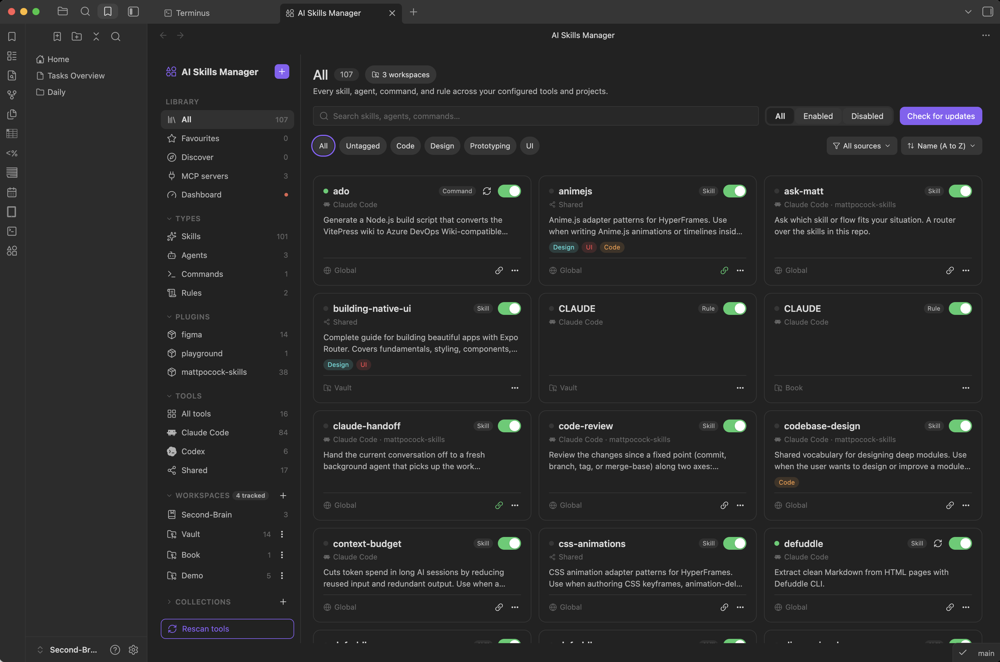
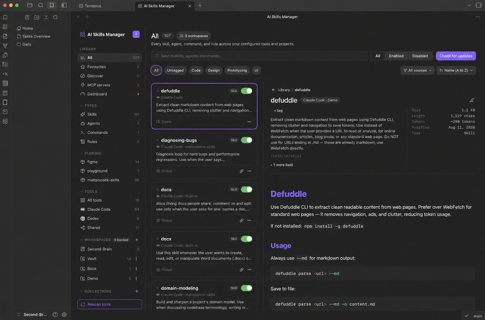
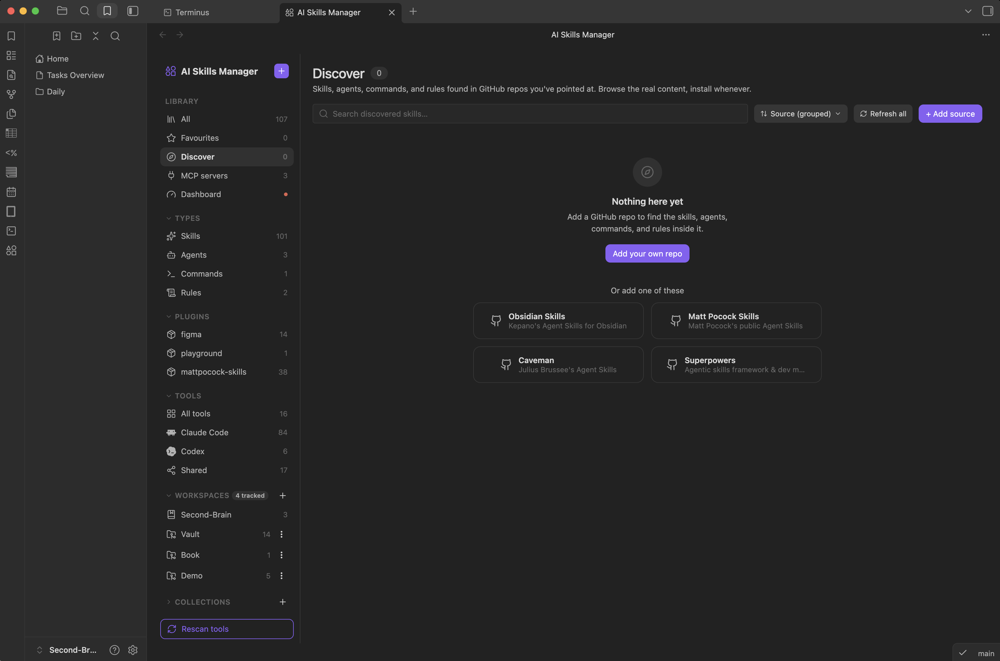
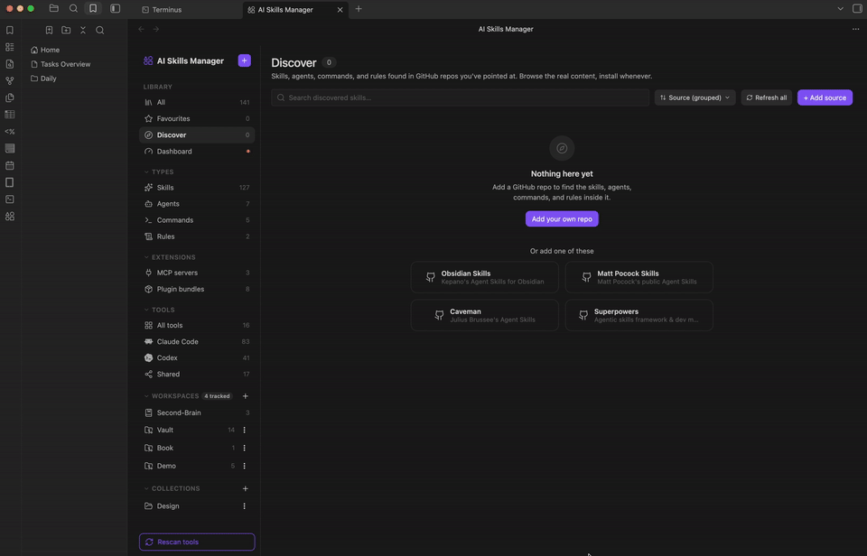
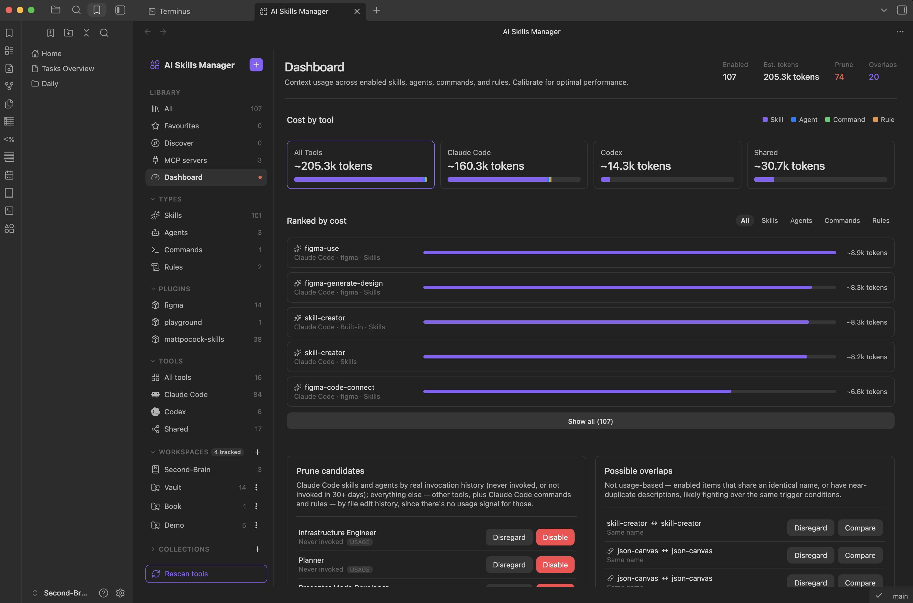

# AI Skills Manager

Browse, tag, and organize AI skills, agents, commands, and rules from inside Obsidian, across every coding tool you use: Claude Code, Cursor, Codex, Gemini CLI, and more.

If you've written a good skill for one tool and then can't find it again, or you keep hand-copying the same prompt into every project and every agent, this plugin turns your scattered `~/.claude/skills`, `~/.cursor/rules`, `.github/prompts`, and similar folders into one searchable, taggable library, without moving your files out of the places those tools actually read from.



## Why this exists

- **Skills pile up in a graveyard of folders.** Every coding tool invents its own convention for where skills, agents, commands, and rules live: some global, some per-project, some both. Nothing shows you all of it at once.
- **Copying between tools is pure manual friction.** The same system prompt ends up pasted into three different tools' folders, drifting out of sync the moment one copy gets edited.
- **Enabling/disabling isn't really enabling/disabling.** A checkbox in a manager that doesn't touch the actual file the tool reads isn't doing anything.
- **Updating an installed skill is a leap of faith.** Pull from GitHub again and you overwrite your local copy blind, with no idea what actually changed.

AI Skills Manager works directly on the real folders each tool reads. It doesn't import your skills into a separate managed copy: enabling, disabling, tagging, and organizing all act on the files in place.

## Features

**One library, every tool**
Scans the real, tool-specific folders for skills, agents, commands, and rules across 15 coding tools out of the box (see the table below), plus the cross-tool `~/.agents/skills` shared convention, at both the global (home directory) level and per-project. Every path is editable in Settings if a tool changes its layout or you use a nonstandard setup.

**Enable/disable that actually works**
Toggling an item physically moves it into (or out of) a sibling disabled folder next to it. It's symlink-aware, so a project-linked item stays correctly linked either way. The tool genuinely stops seeing it, rather than a checkbox that only lives in the plugin's own memory.

**Tags, favorites, and collections**
Organize items with your own tags, star favorites, and group related skills/agents/commands/rules into collections that span tools and projects.

**Vault-native metadata**
Per-item metadata (tags, favorites, collection membership) is stored as plain frontmatter in small markdown notes inside your vault, not hidden in a JSON blob. That means it syncs via whatever you already use to sync your vault, and it's queryable from Dataview or Bases like any other note.



**Link a global skill into a project**
Add a global skill to a project workspace and it's symlinked into that project's local tool folder, never copied, so it can't drift out of sync with the source. Remove it and only the link goes away; the original is untouched.

**Discover and install from GitHub**
Point Discover at a GitHub repo (or a specific subfolder) and it walks it for `SKILL.md` files and agent/command/rule markdown, showing star counts and previews before you install. Or paste a repo URL (or a GitHub `tree` URL for one branch/subfolder) directly into "Install from GitHub" and pick which tool, type, and project (or global) it lands in.





**Check for updates, with a real diff**
For anything installed through the plugin, "Check for updates" fetches the source repo and shows exactly what changed, including companion files like `references/` and `scripts/` alongside the main manifest, before you apply anything. "Restore" reverts an item back to the exact commit it was installed at. An optional background interval can check every tracked source on its own and flag what's stale, without ever applying an update for you.

**Claude Code plugin awareness**
Reads Claude Code's installed-plugins registry so skills, agents, and commands bundled inside an installed Claude Code plugin show up in the library too, tagged with the plugin they came from.

**Dashboard: context cost, usage, and overlaps**
A dedicated tab that estimates the context footprint of everything you currently have enabled, broken down by tool and ranked item by item. For Claude Code specifically, it reads your real `~/.claude/projects` session transcripts to build a "Top Skills & Agents" usage ranking and to flag prune candidates that have never fired or gone stale, instead of guessing from file age. Everywhere else, a file-age-based heuristic flags large items that haven't been touched in a while. A separate "Possible overlaps" list catches enabled items sharing an exact name (an unambiguous collision) or near-duplicate descriptions, likely competing for the same trigger conditions, with a side-by-side compare before you disable one.

Any prune or overlap suggestion can be dismissed with "Disregard" so it stops resurfacing, without touching the item itself.



**MCP servers, read-only**
A dedicated page lists every MCP server configured across your tools, global and per-project, read straight from each tool's own config file (`~/.claude.json`, `.mcp.json`, `~/.codex/config.toml`, `.vscode/mcp.json`, and more). It's visibility only, nothing here can enable, disable, or edit a server, but you can jump straight to its config file to do that by hand.

**Built for scanning, not guessing**
A file-tree preview with per-file size and estimated token count for multi-file skills, a background auto-rescan interval you control, and a reorderable sidebar (by type, plugin, tool, project, or collection) that can hide rows with nothing in them.

## Supported tools

| Tool | Skills | Agents | Commands | Rules |
|---|:---:|:---:|:---:|:---:|
| Claude Code (+ its plugins) | ✓ | ✓ | ✓ | ✓ |
| Cursor | ✓ | ✓ | | ✓ |
| Codex | ✓ | ✓ | ✓ | |
| OpenCode | ✓ | ✓ | ✓ | |
| Antigravity | ✓ | ✓ | ✓ | ✓ |
| GitHub Copilot | ✓ | | ✓ | ✓ |
| Cline | ✓ | | ✓ | ✓ |
| Trae | ✓ | | | ✓ |
| Windsurf | ✓ | | | ✓ |
| Goose | ✓ | | | |
| Hermes | ✓ | | | |
| Pi | ✓ | | | ✓ |
| Gemini CLI | | | ✓ | |
| Roo Code | | | | ✓ |
| Continue | | | ✓ | ✓ |
| Shared (`~/.agents/skills`) | ✓ | | | |

Rules is a mix of directories of many rule files (e.g. Cursor's `.cursor/rules/`) and single instructions files that are scanned and toggled as one item (e.g. Claude Code's `CLAUDE.md`, Pi's `AGENTS.md`).

Checkmarks reflect the paths scanned by default. Every one of them, plus a few documented-but-unconfirmed guesses for newer tools, can be added, changed, or turned off per tool in Settings.

## Installation

1. In Obsidian, open **Settings → Community plugins**.
2. Make sure **Restricted mode** is off.
3. Click **Browse**, search for "AI Skills Manager", and select it.
4. Click **Install**, then **Enable**.

AI Skills Manager is desktop-only: it reads and writes files directly on disk (and shells out to `git` for the GitHub-powered Discover, install, and update features), which isn't available in Obsidian's mobile sandbox.

## Getting started

1. Open the library from the ribbon icon (shapes) or the **Open library** command.
2. It scans every configured tool's folders automatically, nothing to set up for the common case.
3. Tag, favorite, or add items to a collection from the detail panel or right-click menu.
4. Toggle an item on or off directly from its card.
5. Add a project workspace from the "+" next to Workspaces in the sidebar to see that project's local skills alongside your global ones, and to link global skills into it.
6. Use **Discover** to browse a GitHub repo for skills/agents/commands/rules and install what you want, or use **Install from GitHub** directly if you already know the repo.
7. For anything installed that way, use **Check for updates** on its detail panel to review a diff before pulling in changes, or **Restore** to revert to the version you installed.
8. Open the **Dashboard** tab any time to see context cost by tool, what's probably safe to prune, and where two items might be overlapping.
9. Open **MCP servers** from the sidebar to see every server configured across your tools, global and per-project, and jump to its config file.

## Settings

- **Storage folder**: where the plugin's metadata notes live in your vault (default: `AI Skills Manager`).
- **Library view**: auto-rescan interval, default sort order, default enabled/disabled filter, and whether to show tools/projects with nothing found in them.
- **Auto check for updates**: an optional background interval (off by default) that checks every tracked source against its remote and flags what's stale.
- **MCP config editor app**: macOS only; which app "Open config file" on an MCP server should use, overriding the OS's default file association.
- **Tools**: every tool's global and project-scoped paths, editable per type, with a live "found/not found" check against your actual filesystem. Managed from the "All tools" page in the library sidebar.
- **Project workspaces**: managed from the Workspaces section of the library sidebar rather than the settings tab; add, edit, or remove project folders (beyond the current vault) to scan for project-local skills.

## Development

```bash
npm install
npm run dev     # watch build
npm run build   # type-check + production build
npm run lint
```

## License

MIT
