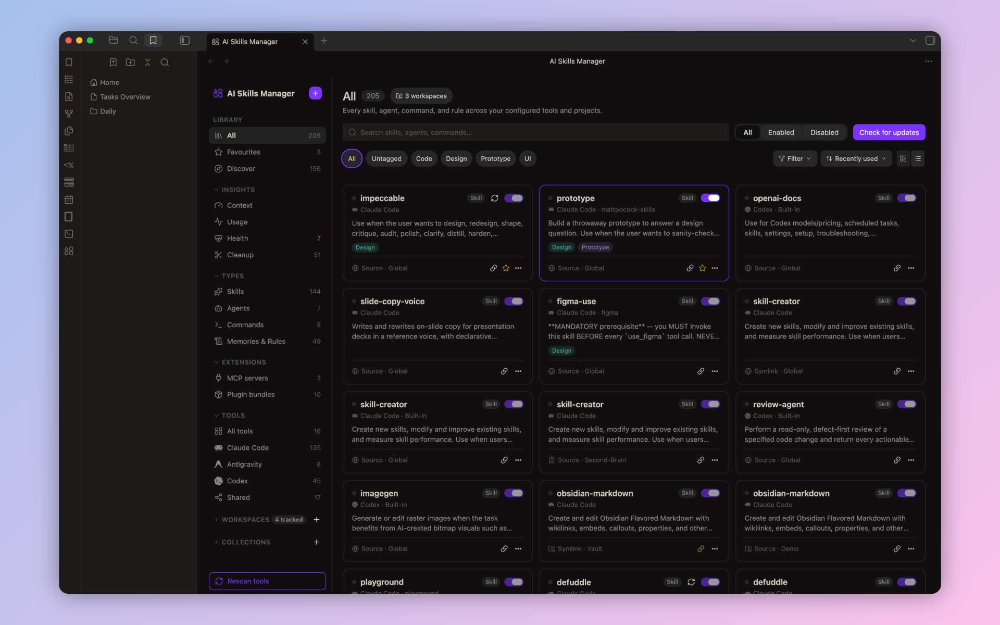
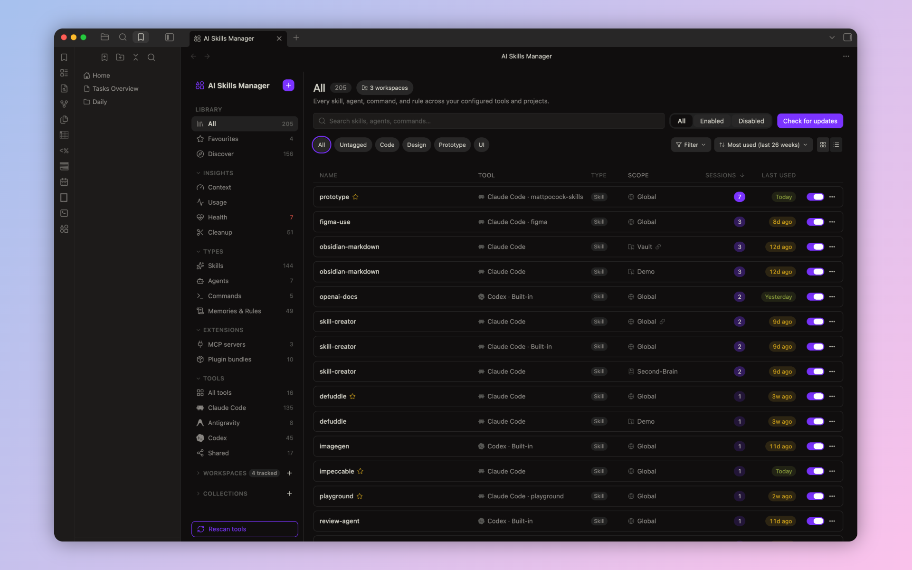
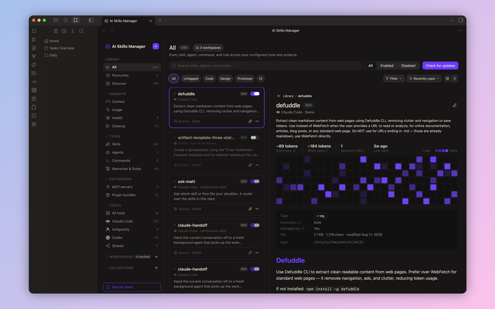
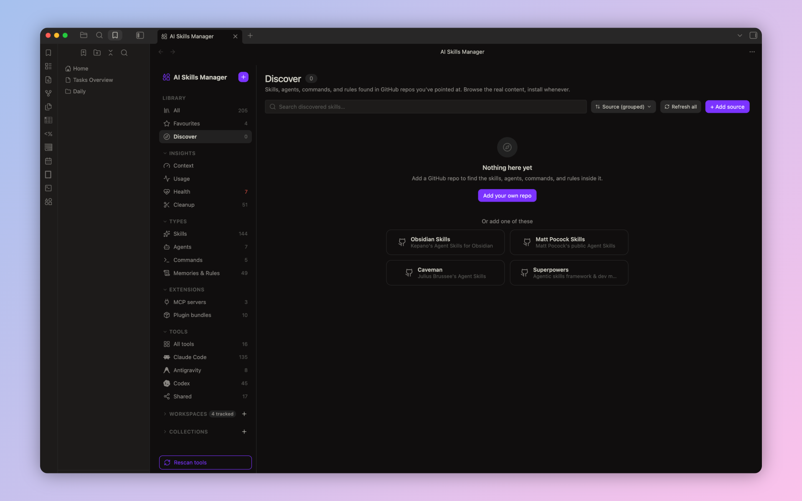
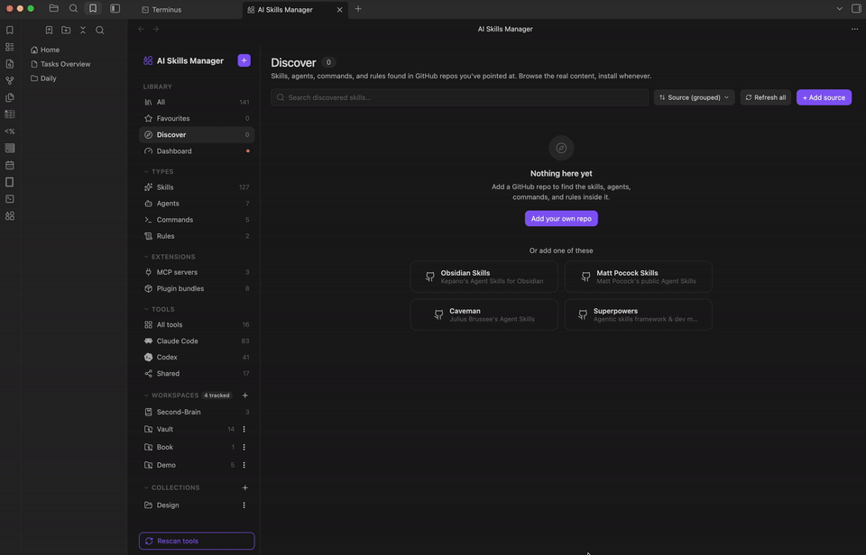
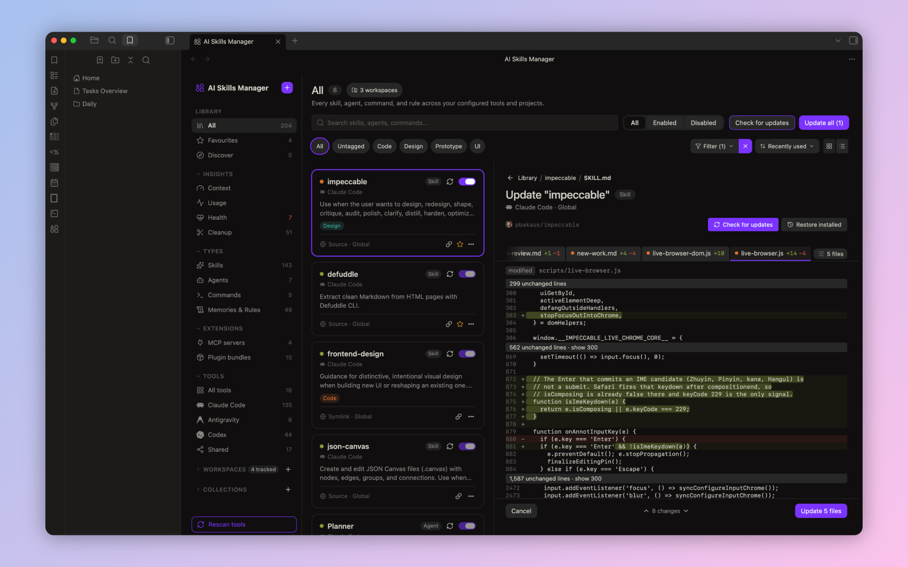
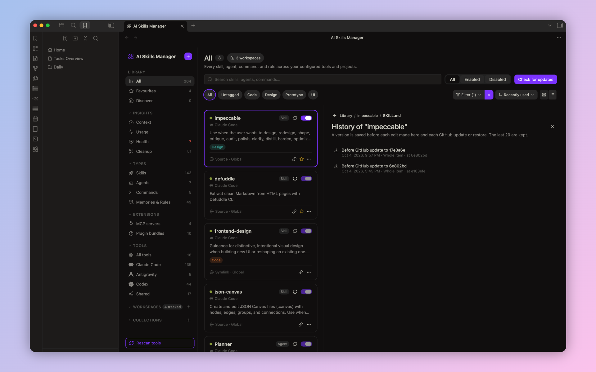
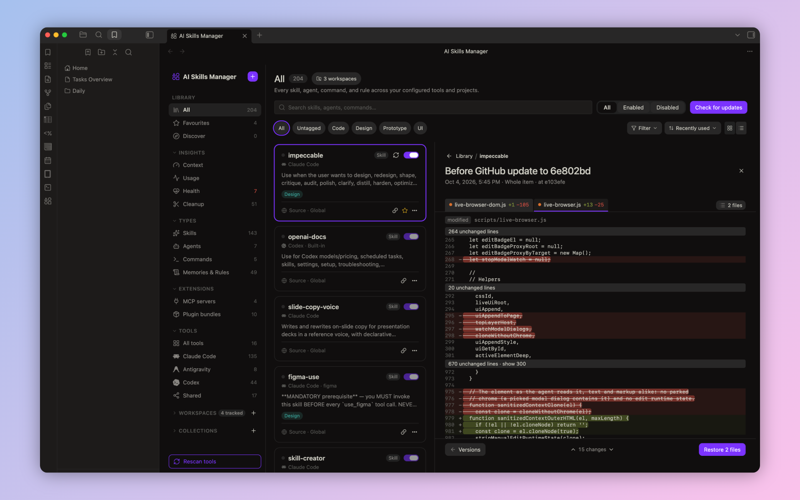
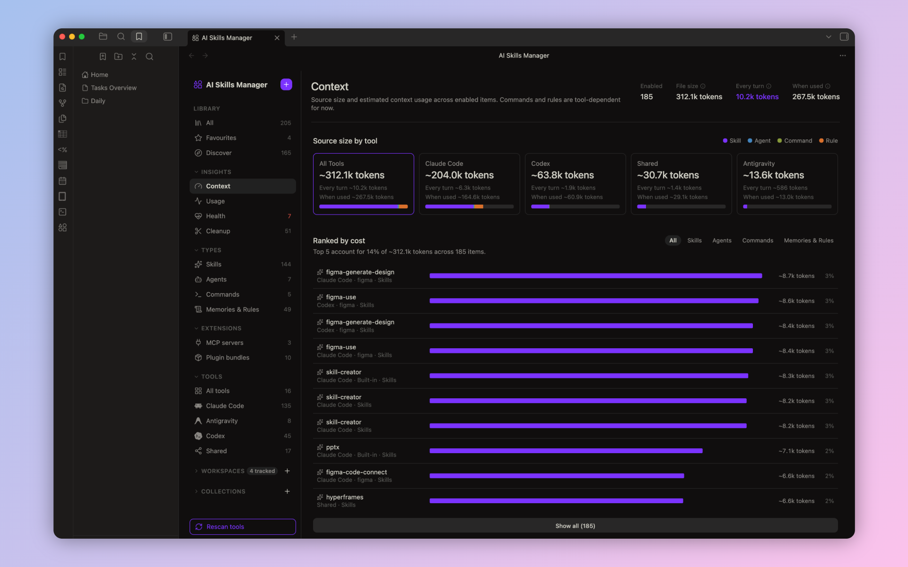
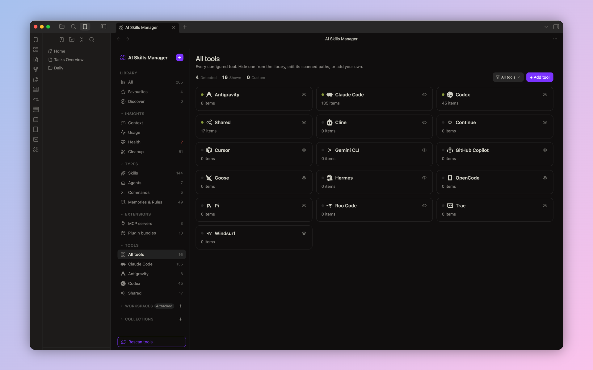

<h1 align="center">AI Skills Manager</h1>

<p align="center">
  Browse, tag, and organize AI skills, agents, commands, rules, and agent memories from inside Obsidian, across every coding tool you use: Claude Code, Cursor, Codex, Gemini CLI, and more.
</p>

<p align="center">
  <a href="https://github.com/NoteNerdOfficial/ai-skills-manager/stargazers"></a>
  <a href="https://github.com/NoteNerdOfficial/ai-skills-manager/graphs/contributors"></a>
  <a href="https://github.com/NoteNerdOfficial/ai-skills-manager/commits/main"></a>
</p>

<p align="center">
  <a href="https://github.com/NoteNerdOfficial/ai-skills-manager/releases/latest"></a>
  <a href="https://obsidian.md/plugins?id=ai-skills-manager"></a>
</p>

If you've written a good skill for one tool and then can't find it again, or you keep hand-copying the same prompt into every project and every agent, this plugin turns your scattered `~/.claude/skills`, `~/.cursor/rules`, `.github/prompts`, and similar folders into one searchable, taggable library, without moving your files out of the places those tools actually read from.



## Why this exists

- **Skills pile up in a graveyard of folders.** Every coding tool invents its own convention for where skills, agents, commands, and rules live: some global, some per-project, some both. Nothing shows you all of it at once.
- **Copying between tools is pure manual friction.** The same system prompt ends up pasted into three different tools' folders, drifting out of sync the moment one copy gets edited.
- **Enabling/disabling isn't really enabling/disabling.** A checkbox in a manager that doesn't touch the actual file the tool reads isn't doing anything.
- **Updating an installed skill is a leap of faith.** Pull from GitHub again and you overwrite your local copy blind, with no idea what actually changed.

AI Skills Manager works directly on the real folders each tool reads. It doesn't import your skills into a separate managed copy: enabling, disabling, tagging, and organizing all act on the files in place.

## Contents

- [Features](#features)
- [Supported tools](#supported-tools)
- [Installation](#installation)
- [Getting started](#getting-started)
- [Settings](#settings)
- [Development](#development)
- [Contributing](#contributing)
- [License](#license)

## Features

**One library, every tool**
Scans the real, tool-specific folders for skills, agents, commands, and rules across 15 coding tools out of the box (see the table below), plus the cross-tool `~/.agents/skills` shared convention, at both the global (home directory) level and per-project. Every path is editable in Settings if a tool changes its layout or you use a nonstandard setup.

**Enable/disable that actually works**
Toggling an item physically moves it into (or out of) a sibling disabled folder next to it. It's symlink-aware, so a project-linked item stays correctly linked either way. The tool genuinely stops seeing it, rather than a checkbox that only lives in the plugin's own memory.

**Grid or list view**
Switch the library between cards and a compact list from the toggle next to Sort. The list shows each item's tool, type, scope, sessions, and last used at a glance, color-coded so busy and idle items stand out. Click a column header to sort by name, most used, or recently used. The choice is remembered.



**Tags, favorites, and collections**
Organize items with your own tags, star favorites, and group related skills/agents/commands/rules into collections that span tools and projects.

**Vault-native metadata**
Per-item metadata (tags, favorites, collection membership) is stored as plain frontmatter in small markdown notes inside your vault, not hidden in a JSON blob. That means it syncs via whatever you already use to sync your vault, and it's queryable from Dataview or Bases like any other note.

**A detail panel that answers the important questions first**
Opening an item shows its name and type, the tool (and plugin) it belongs to, and its description. Below that, a row of key numbers: estimated tokens while it's available, tokens loaded when it's invoked, sessions over the last 26 weeks, and when it was last used. A daily usage heatmap spanning the last 26 weeks appears once there's any use to chart. The plugin keeps its own daily usage history for Claude Code and Codex, so it outlasts the tools' own transcript cleanup.

Everything else sits in one properties panel: tags, whether it runs automatically or only when called, who manages it (you, a GitHub source, a plugin, or the tool itself) and what that means for edits and updates, version, any other frontmatter fields, file size, path, and where it's symlinked from. For items installed from GitHub, the panel ends with the source repo and its **Check for updates** and **Restore installed** buttons. The **History** button next to Edit opens the item's saved versions.

**Integrity checks**
Problems that make a tool skip an item or never pick it up are flagged on the item and collected on the Insights Health page: broken or missing frontmatter, a name that doesn't match its folder, a missing or overlong description, a broken symlink, a link to a bundled file that isn't there, or a memory its index never points to.



**Agent memories**
Memory files an agent writes for itself are listed under **Memories & Rules**, next to your rules. Claude Code's auto-memory (`~/.claude/projects/<project>/memory/`) is picked up by default and matched to your project workspaces. Disabling a memory also removes its line from the folder's `MEMORY.md` index, and re-enabling puts the exact line back, so the agent really stops (or starts) loading it. Other tools' memory folders, global or inside each project, can be set per tool.

**Link a global skill into a project**
Add a global skill to a project workspace and it's symlinked into that project's local tool folder, never copied, so it can't drift out of sync with the source. Remove it and only the link goes away; the original is untouched.

**Discover and install from GitHub**
Point Discover at a GitHub repo (or a specific subfolder) and it walks it for `SKILL.md` files and agent/command/rule markdown, showing star counts and previews before you install. Or paste a repo URL (or a GitHub `tree` URL for one branch/subfolder) directly into "Install from GitHub" and pick which tool, type, and project (or global) it lands in.





**Check for updates, with a real diff**
For anything installed through the plugin, "Check for updates" fetches the source repo and shows exactly what changed before you apply anything. Every changed file gets its own tab, with its status and line counts, so an update that touches `references/` or `scripts/` shows those diffs too, not just the main manifest. Long unchanged stretches fold away, the arrows in the bottom bar (or `J` and `K`) step from one change to the next across every file, and `[` and `]` switch files. "Restore installed" reverts an item back to the exact commit it was installed at. An optional background interval can check every tracked source on its own and flag what's stale, without ever applying an update for you.

On the All page, **Check for updates** checks every tracked item at once. An item only counts as stale when its own files changed, not just because something else in the same repo did. Items that do have updates are shown on their own right away (the **Updates available** source filter), and opening one shows a banner with a **Review changes** button that opens the same diff.



**Version history**
A version of an item is saved before every edit you make in the detail panel and before every GitHub update or restore, so nothing you change here is a one-way trip. Open **History** from the detail panel to see each saved version, named after the change that followed it ("Before edit to SKILL.md", "Before GitHub update to 6e802bd") with its date and commit.



Open a version to see what restoring it would change, in the same tabbed diff as an update review, then restore it in one click. Restoring saves the current state first, so a restore can be undone too. Restoring a version of a GitHub-installed item also puts its tracked commit back, so "Check for updates" stays accurate. The last 20 versions of each item are kept, in the plugin's own folder.



**Claude Code and Codex plugin awareness**
Reads Claude Code's installed-plugins registry and Codex's installed plugin cache so skills, agents, and commands bundled inside installed plugins show up in the library too, tagged with the plugin they came from. Codex plugins are read-only here because AI Skills Manager has no supported Codex setting for enabling or disabling an installed plugin. Manage Codex plugins from Codex itself.

Installed bundles are browsable from **Library → Plugin bundles**, with search, tool/group/tag filters, sorting, and a breadcrumb back from a bundle's item list.

**Insights**
A collapsible sidebar section with four pages, each answering one question:

- **Context**: what's taking up context? Separates representative source-file size from estimated context exposure, by tool and ranked per item. For skills and agents, metadata available before invocation is shown separately from instruction tokens loaded on invocation; commands and rules are marked tool-dependent until their per-tool loading policies are modeled. The ranked list shows each item's share of the total, sums up how much the top five account for, and rescales when you filter by tool or type.
- **Usage**: what do you actually use? Reads Claude Code and Codex session history (`~/.claude/projects` and `~/.codex/sessions`) for a weekly activity chart and a ranked list of your most-used skills and agents.
- **Health**: what's broken? Broken symlinks and integrity issues. Its sidebar badge counts open problems.
- **Cleanup**: what could go? Prune candidates (Claude Code skills and agents that never fired or have gone stale, and a file-age heuristic everywhere else) and possible overlaps (enabled items sharing an exact name or near-duplicate descriptions), with a restore window after you disable something.



On Health and Cleanup, each problem is one row: the item's name, a colored status pill, and a one-line explanation of what's wrong. Expand a row for the details (tool, type, description, location, last edit, and for prune candidates the last invocation and context cost) and the actions that fix it, always in the same order: the fix, Open, then Disregard. Broken symlinks can enable a disabled source or reveal the link in your file manager. An expanded overlap shows both items side by side with their full descriptions, so you can disable, open, or delete either one in place.

Any suggestion can be dismissed with "Disregard" so it stops resurfacing, without touching the item itself. "Show disregarded" on each section lists what you've dismissed and brings any of it back.

**MCP servers, read-only**
A dedicated page lists every MCP server configured across your tools, global and per-project, read straight from each tool's own config file (`~/.claude.json`, `.mcp.json`, `~/.codex/config.toml`, `.vscode/mcp.json`, and more). It's visibility only, nothing here can enable, disable, or edit a server, but you can jump straight to its config file to do that by hand.

**Built for scanning, not guessing**
A file-tree preview with per-file size and estimated token count for multi-file skills, a background auto-rescan interval you control, and a reorderable sidebar (by type, plugin, tool, project, or collection) that can hide rows with nothing in them.

## Supported tools

| Tool | Skills | Agents | Commands | Rules |
|---|:---:|:---:|:---:|:---:|
| Claude Code (+ its plugins) | ✓ | ✓ | ✓ | ✓ |
| Cursor | ✓ | ✓ | | ✓ |
| Codex | ✓ | ✓ | ✓ | ✓ |
| OpenCode | ✓ | ✓ | ✓ | |
| Antigravity | ✓ | ✓ | ✓ | ✓ |
| GitHub Copilot | ✓ | | ✓ | ✓ |
| Cline | ✓ | | ✓ | ✓ |
| Trae | ✓ | | | ✓ |
| Windsurf | ✓ | | | ✓ |
| Goose | ✓ | | | |
| Hermes | ✓ | | | |
| Pi | ✓ | | | ✓ |
| Gemini CLI | | | ✓ | |
| Roo Code | | | | ✓ |
| Continue | | | ✓ | ✓ |
| Shared (`~/.agents/skills`) | ✓ | | | |

Rules is a mix of directories of many rule files (e.g. Cursor's `.cursor/rules/`) and single instructions files that are scanned and toggled as one item (e.g. Claude Code's `CLAUDE.md`, Codex's `AGENTS.md`, Antigravity's `GEMINI.md` and `AGENTS.md`, Pi's `AGENTS.md`). Codex's `AGENTS.md` files are persistent instructions, not Claude-style auto-memory files; no Codex memory directory is assumed by default.

Checkmarks reflect the paths scanned by default. Every one of them, plus a few documented-but-unconfirmed guesses for newer tools, can be added, changed, or turned off per tool in Settings.

Support for additional tools and edge cases is welcome. If you use one of these tools and can test a layout, share feedback, or improve its scanner, see [CONTRIBUTING.md](CONTRIBUTING.md).



## Installation

1. In Obsidian, open **Settings → Community plugins**.
2. Make sure **Restricted mode** is off.
3. Click **Browse**, search for "AI Skills Manager", and select it.
4. Click **Install**, then **Enable**.

AI Skills Manager is desktop-only: it reads and writes files directly on disk (and shells out to `git` for the GitHub-powered Discover, install, and update features), which isn't available in Obsidian's mobile sandbox.

Deleting an item, or updating one from GitHub, moves the old copy to your system Trash instead of erasing it. On macOS the plugin asks Finder to do this so **Put Back** works, which means macOS asks once for permission to let Obsidian control Finder. If you decline, items still go to the Trash, just without Put Back.

## Getting started

1. Open the library from the ribbon icon (shapes) or the **Open library** command.
2. It scans every configured tool's folders automatically, nothing to set up for the common case.
3. Tag, favorite, or add items to a collection from the detail panel or right-click menu.
4. Toggle an item on or off directly from its card.
5. Add a project workspace from the "+" next to Workspaces in the sidebar to see that project's local skills alongside your global ones, and to link global skills into it.
6. Use **Discover** to browse a GitHub repo for skills/agents/commands/rules and install what you want, or use **Install from GitHub** directly if you already know the repo.
7. For anything installed that way, use **Check for updates** on its detail panel to review a diff before pulling in changes, or **Restore** to revert to the version you installed.
8. Open the **Insights** pages any time to see estimated context exposure by tool, what you actually use, what's broken, and what's probably safe to prune or merge.
9. Open **MCP servers** from the sidebar to see every server configured across your tools, global and per-project, and jump to its config file.

## Settings

- **Storage folder**: where the plugin's metadata notes live in your vault (default: `AI Skills Manager`).
- **Library view**: auto-rescan interval, default sort order, default enabled/disabled filter, and whether to show tools/projects with nothing found in them.
- **Auto check for updates**: an optional background interval (off by default) that checks every tracked source against its remote and flags what's stale.
- **MCP config editor app**: macOS only; which app "Open config file" on an MCP server should use, overriding the OS's default file association.
- **Tools**: every tool's global and project-scoped paths, editable per type (plus an optional memory folder), with a live "found/not found" check against your actual filesystem. Managed from the "All tools" page in the library sidebar.
- **Project workspaces**: managed from the Workspaces section of the library sidebar rather than the settings tab; add, edit, or remove project folders (beyond the current vault) to scan for project-local skills.


## Development

```bash
npm install
npm run dev     # watch build
npm run build   # type-check + production build
npm run lint
```

## Contributing

Contributions are welcome, especially from people who use tools we cannot test locally. See [CONTRIBUTING.md](CONTRIBUTING.md) for setup instructions, scanner guidance, fixture patterns, and testing expectations.

## License

MIT
